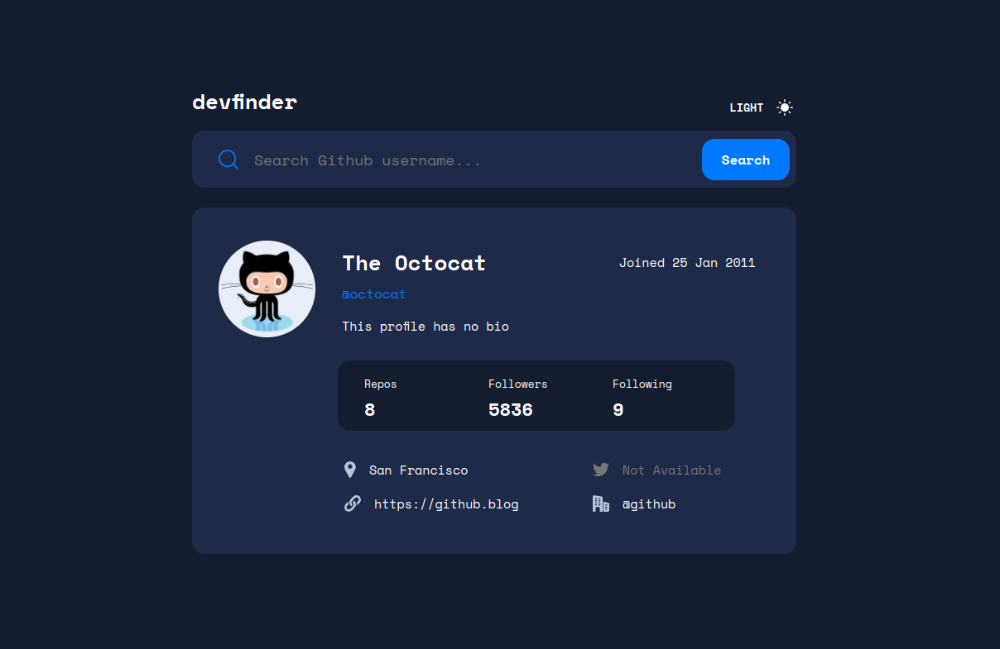

# Frontend Mentor - GitHub user search app solution

This is a solution to the [GitHub user search app challenge on Frontend Mentor](https://www.frontendmentor.io/challenges/github-user-search-app-Q09YOgaH6). Frontend Mentor challenges help you improve your coding skills by building realistic projects.

## Table of contents

- [Overview](#overview)
  - [The challenge](#the-challenge)
  - [Screenshot](#screenshot)
  - [Links](#links)
- [My process](#my-process)
  - [Built with](#built-with)
  - [What I learned](#what-i-learned)
  - [Continued development](#continued-development)
  - [Useful resources](#useful-resources)
- [Author](#author)
- [Acknowledgments](#acknowledgments)

**Note: Delete this note and update the table of contents based on what sections you keep.**

## Overview

### The challenge

Users should be able to:

- View the optimal layout for the app depending on their device's screen size
- See hover states for all interactive elements on the page
- Search for GitHub users by their username
- See relevant user information based on their search
- Switch between light and dark themes
- **Bonus**: Have the correct color scheme chosen for them based on their computer preferences. _Hint_: Research `prefers-color-scheme` in CSS.

### Screenshot

### Links

- Solution URL: [Solution](https://curious-alfajores-7e606e.netlify.app/)
- Live Site URL: [Live Site](https://curious-alfajores-7e606e.netlify.app/)

## My process

### Built with

- [React](https://reactjs.org/) - JS library
- CSS custom properties
- Flexbox
- CSS Grid

### What I learned

This was my first React App without a tutorial code-along. It was a very interesting journey. I can say I fully grok props and state and how the components interact with eachother. I learned how to fully utilise css custom properties and implement a theme changer. This aspect of the challenge definetly stumped me the most. The solution ended up being pretty simple compared to some of the tutorials / solutions I came across online while researching the problem.

### Continued development

I plan on continuing my React journey and try to focus more on functional components rather then class components. I learned state using Class components so felt most comfotable implementating this solution use class components. However I notice that it does have some limitations.

## Author

- Website - [Joe Irvine](https://www.joeirvine.com)
- Frontend Mentor - [@TheShonuff](https://www.frontendmentor.io/profile/TheShonuff)
- Twitter - [@TheDevShonuff](https://www.twitter.com/TheDevShonuff)
